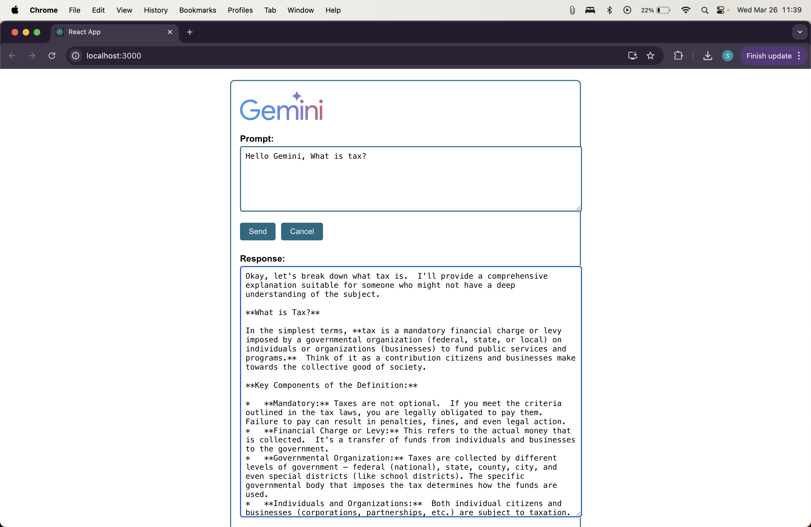
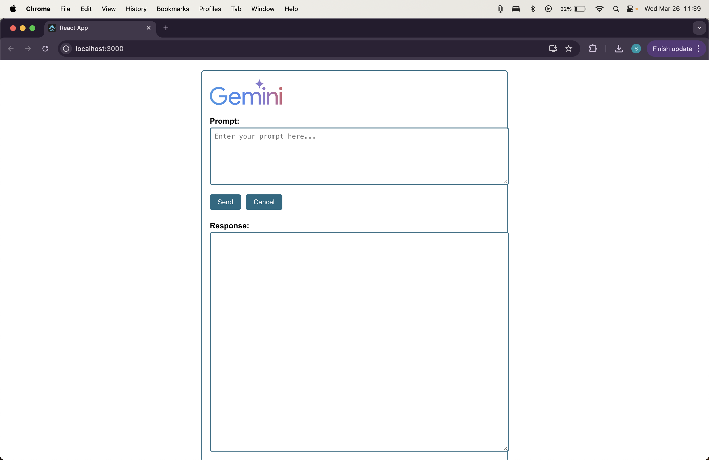

# Gemini 2.0 Flash Chat App 💬✨

This project is a full-stack AI-powered chat application that integrates **Google’s Gemini 2.0 Flash-001**, a cutting-edge multimodal large language model (LLM), to enable natural language conversations through a sleek web interface.

Gemini 2.0 Flash is optimized for fast, scalable, and context-rich interactions, supporting up to **1 million tokens** and designed for tasks like reasoning, code generation, data extraction, and question answering. This app demonstrates how to integrate Gemini’s powerful capabilities into a real-time chat experience.

---

## 🧠 Key Features

- Built using **React** (frontend) and **Express.js** (backend)
- Connects to Gemini via the official `@google/generative-ai` SDK
- Uses `startChat()` to generate contextual, smart replies
- Includes a Gemini-themed UI with **Prompt**, **Send/Cancel**, and **Response** sections
- Logs interactions locally to support review and auditing

---

## 🖼️ App Screenshots

---

> Powered by Google Gemini 2.0 Flash | Built for intelligent conversations ✨
